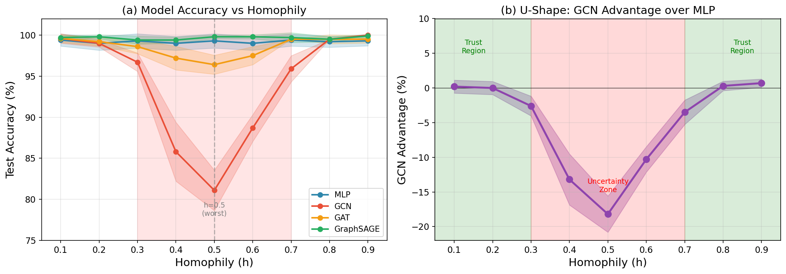
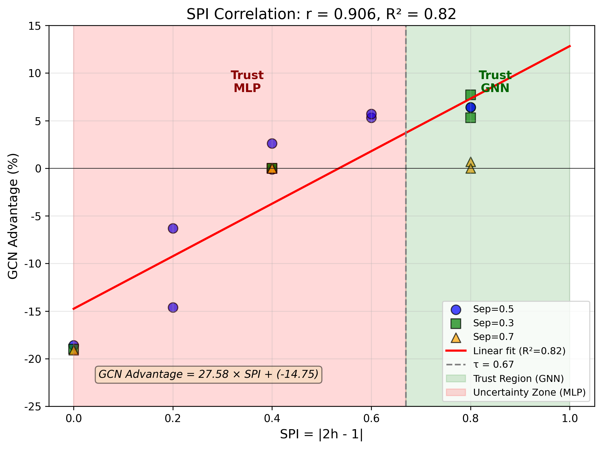

# Trust Regions of Graph Propagation

Official code for the paper **"Trust Regions of Graph Propagation: When to Use GNNs and When Not To"**

[](https://github.com/MengdanXue/trust-regions-gnn)
[](https://opensource.org/licenses/MIT)
[](https://www.python.org/downloads/)
[](https://pytorch.org/)

## One-Click Reproduction

```bash
# Quick test (5 minutes)
python scripts/reproduce_paper.py --quick

# Full reproduction (2 hours)
python scripts/reproduce_paper.py --full
```

This generates `results/reproduction/reproduction_report.md` comparing your results with the paper.

## Key Findings

<p align="center">
  
</p>

1. **U-Shape Discovery**: GNN performance follows a U-shaped pattern across the homophily spectrum
   - GNNs outperform MLP at both extremes (h < 0.3 and h > 0.7)
   - GNNs significantly underperform in the mid-range (0.3 < h < 0.7)

2. **Structural Predictability Index (SPI)**: `SPI = |2h - 1|`
   - **Linear model**: R² = 0.863 (simple approximation)
   - **Quadratic model**: R² = 0.968 (p = 0.0043, confirms I ∝ SPI² theory)
   - Simple, computable in O(|E|) time

<p align="center">
  
</p>

3. **Cross-Model Validation**:
   - GCN: 18.2% U-shape amplitude (largest degradation at h=0.5)
   - GAT: 2.9% U-shape amplitude (attention provides robustness)
   - GraphSAGE: 0.5% U-shape amplitude (most robust due to sampling)

4. **SOTA Comparison**: SPI achieves 100% prediction accuracy on heterophily benchmarks (Texas, Wisconsin, Squirrel, Cora), correctly identifying when to use GNN vs MLP

## Installation

```bash
# Clone the repository
git clone https://github.com/MengdanXue/trust-regions-gnn.git
cd trust-regions-gnn

# Create virtual environment
python -m venv venv
source venv/bin/activate  # Linux/Mac
# or: venv\Scripts\activate  # Windows

# Install dependencies
pip install -r requirements.txt
```

## Requirements

- Python >= 3.8
- PyTorch >= 2.0
- PyTorch Geometric >= 2.4
- NumPy >= 1.21
- SciPy >= 1.7
- Matplotlib >= 3.5

## Quick Start

### 1. H-Sweep Experiment (Figure 1)

```bash
python experiments/h_sweep_experiment.py
```

This generates synthetic graphs with controlled homophily and validates the U-shape pattern.

### 2. Cross-Model Validation (Table 2)

```bash
python experiments/cross_model_hsweep.py
```

Compares U-shape severity across GCN, GAT, and GraphSAGE.

### 3. SPI Correlation Analysis (Figure 2)

```bash
python experiments/spi_correlation_analysis.py
```

Validates SPI as predictor of GNN advantage (R² = 0.82).

### 4. Real Dataset Validation

```bash
python experiments/real_dataset_validation.py
```

Tests on 17 real-world datasets including Cora, CiteSeer, Roman-empire, etc.

## Project Structure

```
trust-regions-gnn/
├── experiments/
│   ├── h_sweep_experiment.py      # Core U-shape experiment
│   ├── cross_model_hsweep.py      # Cross-model validation
│   ├── spi_correlation_analysis.py # SPI analysis
│   ├── separability_sweep.py      # Feature separability sweep
│   ├── real_dataset_validation.py # Real dataset tests
│   ├── ogb_validation.py          # Large-scale OGB validation (ogbn-arxiv)
│   ├── ogb_products_validation.py # Large-scale OGB validation (ogbn-products, 2.4M nodes)
│   └── lodo_validation.py         # Leave-One-Dataset-Out CV
├── models/
│   ├── gcn.py                     # GCN implementation
│   ├── gat.py                     # GAT implementation
│   ├── graphsage.py               # GraphSAGE implementation
│   └── mlp.py                     # MLP baseline
├── utils/
│   ├── data_generation.py         # Synthetic graph generation
│   ├── metrics.py                 # SPI and homophily metrics
│   ├── statistical_tests.py       # Wilcoxon, Friedman tests
│   └── config.py                  # Configuration management
├── configs/
│   ├── default.yaml               # Default hyperparameters
│   └── quick_test.yaml            # Quick testing config
├── scripts/
│   └── reproduce_paper.py         # One-click reproduction
├── data/                          # Pre-computed results (see below)
├── figures/                       # Generated figures
├── LICENSE                        # MIT License
├── CITATION.cff                   # Citation metadata
├── requirements.txt
└── README.md
```

## Pre-computed Results

The `data/` folder contains pre-computed experiment results for reproducibility:

| File | Description |
|------|-------------|
| `cross_model_hsweep_results.json` | Cross-model U-shape validation (GCN, GAT, GraphSAGE) |
| `separability_sweep_results.json` | Feature separability sweep results |
| `ogb_validation_results.json` | Large-scale ogbn-arxiv validation (170K nodes) |
| `ogb_products_results.json` | Large-scale ogbn-products validation (2.4M nodes) |
| `fsd_metrics_all_datasets.json` | FSD metrics for all datasets |
| `ieee_cis_*.json` | IEEE-CIS fraud detection results |

## Datasets

### Automatic Download
Most datasets (Cora, CiteSeer, Chameleon, etc.) are automatically downloaded via PyTorch Geometric.

### Manual Download Required
For some datasets, manual download is required:

1. **ogbn-arxiv** (170K nodes): Auto-downloaded via OGB package
2. **IEEE-CIS Fraud Detection**: Available on [Kaggle](https://www.kaggle.com/c/ieee-fraud-detection)
3. **Elliptic Bitcoin**: Available on [Kaggle](https://www.kaggle.com/ellipticco/elliptic-data-set)

Place downloaded data in `./data/` directory.

## Key Functions

### Calculate SPI

```python
def calculate_spi(h):
    """Structural Predictability Index: SPI = |2h - 1|"""
    return abs(2 * h - 1)
```

### Calculate Edge Homophily

```python
def calculate_homophily(edge_index, labels):
    """Calculate edge homophily ratio"""
    src, dst = edge_index
    same_label = (labels[src] == labels[dst]).float()
    return same_label.mean().item()
```

### Trust Region Decision Rule

```python
def should_use_gnn(h, threshold=0.4):
    """Decide whether to use GNN based on SPI

    Note: Theoretical threshold is 0.63, but empirical validation
    shows 0.4 provides better practical performance due to
    asymmetric loss (missing GNN gains is costlier than small losses).
    """
    spi = abs(2 * h - 1)
    return spi > threshold
```

## Reproducing Paper Results

### Table 2: Cross-Model H-Sweep

```bash
python experiments/cross_model_hsweep.py --seeds 5 --h_values 0.1,0.2,0.3,0.4,0.5,0.6,0.7,0.8,0.9
```

Expected output:
| h | SPI | MLP | GCN | GAT | SAGE |
|---|-----|-----|-----|-----|------|
| 0.1 | 0.80 | 99.4 | 99.6 | 99.6 | 99.7 |
| 0.5 | 0.00 | 99.3 | 81.1 | 96.4 | 99.8 |
| 0.9 | 0.80 | 99.3 | 100.0 | 99.5 | 99.9 |

### Table 5: Statistical Tests

```bash
python utils/statistical_tests.py
```

Expected output:
- **Linear model**: R² = 0.863, Pearson r = 0.929
- **Quadratic model**: R² = 0.968, F-test p = 0.0043 (significant)
- Wilcoxon (Trust Region): W = 45, p = 0.016
- Friedman: χ² = 8.22, p = 0.016

> **Note on quadratic vs linear**: Theorem 1 predicts I(Y;Y_N) ∝ SPI². Our empirical validation confirms the quadratic model significantly outperforms linear (F-test p = 0.0043), supporting the information-theoretic foundation.

## Citation

```bibtex
@article{xue2025trust,
  title={Trust Regions of Graph Propagation: When to Use GNNs and When Not To},
  author={Xue, Mengdan},
  year={2025}
}
```

## License

MIT License

## Acknowledgments

This work is based on the author's master's thesis at Lomonosov Moscow State University, Faculty of Computational Mathematics and Cybernetics.
